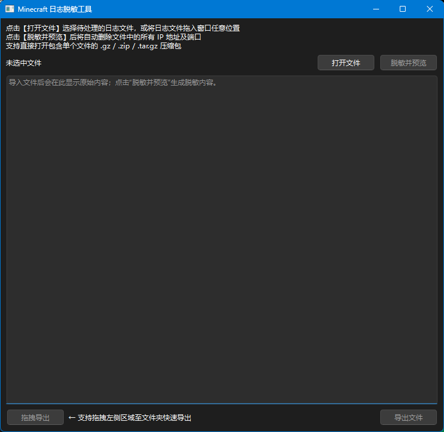

# 简介

我们经常需要把服务器的日志发给别人诊断问题，但日志中包含大量玩家 IP ，作为一名合格的服主我们应该避免泄露这些玩家敏感信息。
但是对动辄几百 KB 的日志来说，手动一个一个删除太麻烦了，所以我写了一个小工具来快速删除日志中的 IP 和端口号。

# 特色

- 支持拖拽导入和导出，大大增加使用效率
- 自动检测文件编码，避免乱码
- 支持直接拖入压缩文件（如 .gz），自动读取其中的日志，无需手动解压

# 软件截图



# 下载地址

- Windows：[GitHub Release](https://github.com/Mooshed88-a/MCLogAnonymizer/releases)

# 许可协议

使用 [Unlicense](./LICENSE) 许可证发布。

```
This is free and unencumbered software released into the public domain.

Anyone is free to copy, modify, publish, use, compile, sell, or
distribute this software, either in source code form or as a compiled
binary, for any purpose, commercial or non-commercial, and by any
means.

In jurisdictions that recognize copyright laws, the author or authors
of this software dedicate any and all copyright interest in the
software to the public domain. We make this dedication for the benefit
of the public at large and to the detriment of our heirs and
successors. We intend this dedication to be an overt act of
relinquishment in perpetuity of all present and future rights to this
software under copyright law.

THE SOFTWARE IS PROVIDED "AS IS", WITHOUT WARRANTY OF ANY KIND,
EXPRESS OR IMPLIED, INCLUDING BUT NOT LIMITED TO THE WARRANTIES OF
MERCHANTABILITY, FITNESS FOR A PARTICULAR PURPOSE AND NONINFRINGEMENT.
IN NO EVENT SHALL THE AUTHORS BE LIABLE FOR ANY CLAIM, DAMAGES OR
OTHER LIABILITY, WHETHER IN AN ACTION OF CONTRACT, TORT OR OTHERWISE,
ARISING FROM, OUT OF OR IN CONNECTION WITH THE SOFTWARE OR THE USE OR
OTHER DEALINGS IN THE SOFTWARE.

For more information, please refer to <https://unlicense.org/>
```

本工具使用了以 [LGPLv3](https://doc.qt.io/qt-6/lgpl.html?utm_source=chatgpt.com) 协议分发的 [Qt6](https://www.qt.io/)。

